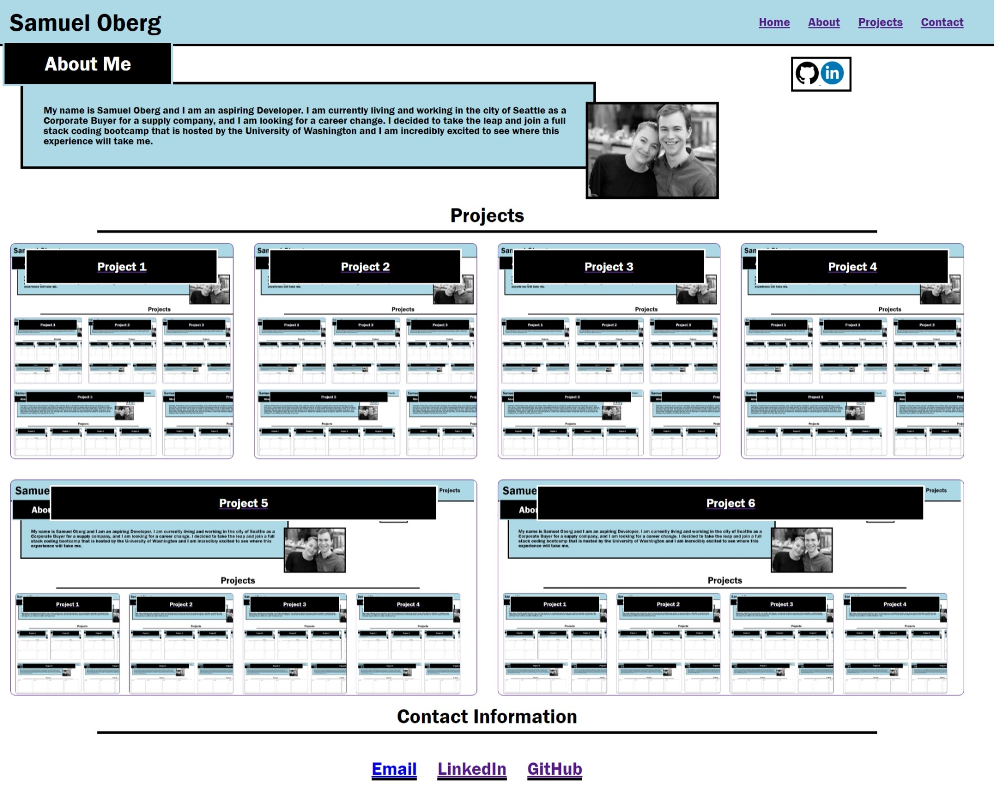

# My Portfolio

## Description
This is my Portfolio webpage, which has my contact information along with links to my future projects. This webpage is made to be responsive and work with all pixel sizes and formats. This is my first webpage coded from scratch with HTML and CSS only. 

For now, my project section is filled with place holders but I will be making updates to this page throughout my career with newer and better projects. 

## Usage

Link: Below is the link to the finished website hosted on github
<http://sosoberg.github.io/portfolio/>